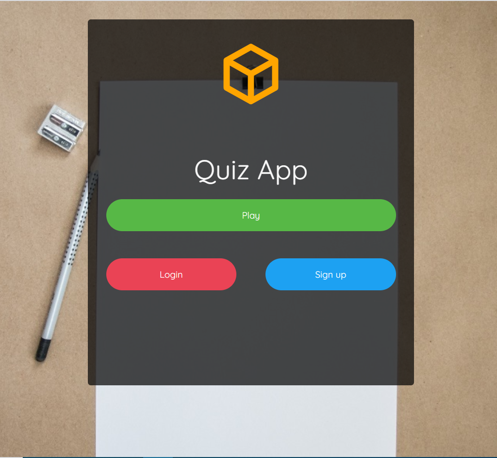
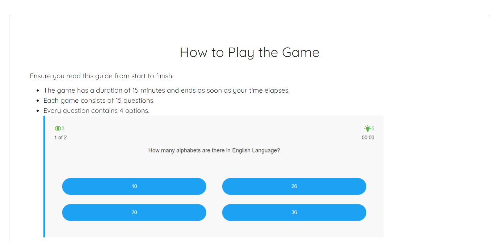
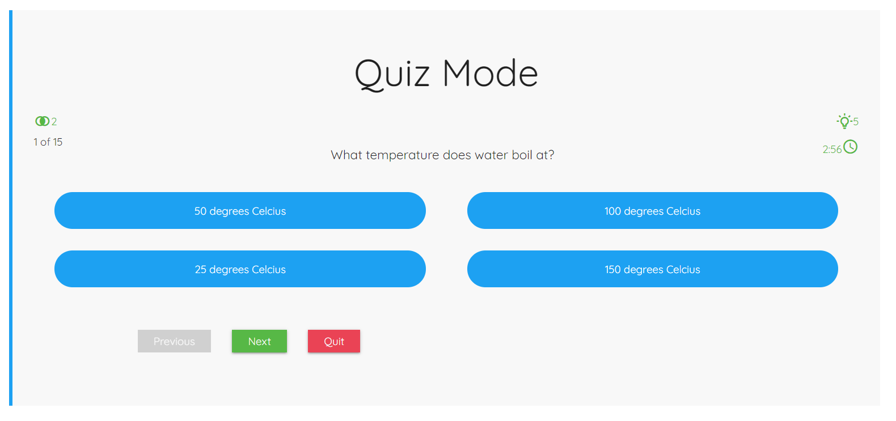
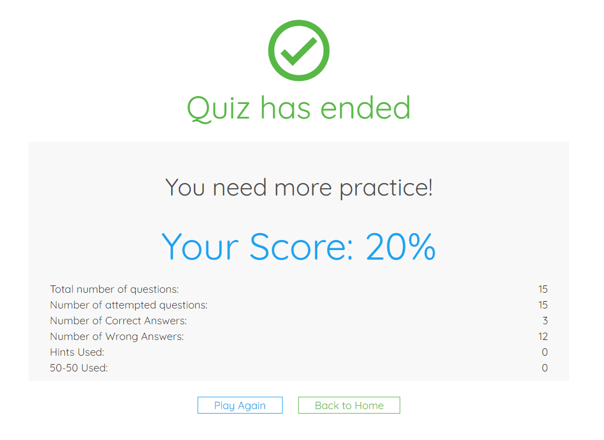

# [React MCQ Quiz]

[![Contributors][contributors-shield]][contributors-url]
[![Forks][forks-shield]][forks-url]
[![Stargazers][stars-shield]][stars-url]
[![Issues][issues-shield]][issues-url]

In this project, we are trying to create Quiz App. This Quiz app is made to understand the React logic, ES6 feature and JS. It contains 15 question, two helping logic called hint & fifty-fifty, summary page and an instruction page as well. 

---

## Live Demo

[Live Link](https://react-mcq-test.herokuapp.com/)


## Landing Page



## Landing Page


## Question Instruction Page



## Question Page



## Game Summary



---

## Built With

- HTML5
- SCSS
- Javascript
- React

---

### Installation

1. Clone the repo

```
git clone https://github.com/shubham14p3/react-mcq-test.git
```

2. CD into the project root directory

```
cd ./react-mcq-test.git
```

3. Install Dependencies and packages

```
yarn install
```

4. Run the server

```
yarn start
```

### Game Feature

- Game has a timelimit of 3 minutes.
- Game has two feature Hint & 50-50
- Game generates Sumary result at the end of every sucessfull completion of game.

### 🤝 Contributing

Contributions, issues and feature requests are welcome! Start by:

- Forking the project
- Cloning the project to your local machine
- `cd` into the project directory
- Run `git checkout -b your-branch-name`
- Make your contributions
- Push your branch up to your forked repository
- Open a Pull Request with a detailed description to the development branch of the original project for a review

---

## Authors

👤 **Shubbham Raj**

- Website: [Shubham Raj](https://www.shubhamraj.dev/)
- Github: [@ShubhamRaj](https://github.com/shubham14p3)
- Linkedin: [Shubham14p3](https://www.linkedin.com/in/shubham14p3/)
- Email: shubham14p3@gmail.com

---

## Show your support

Give a ⭐️ if you like this project!

---

## Future Features

- Registration or Signup
- Mail Integration
- Redesiging th ui

---

## 📝 License

This project is [MIT](lic.url) licensed.

---

<!-- MARKDOWN LINKS & IMAGES -->

[contributors-shield]: https://img.shields.io/github/contributors/shubham14p3/react-mcq-test.svg?style=flat-square
[contributors-url]: https://github.com/shubham14p3/react-mcq-test/graphs/contributors
[forks-shield]: https://img.shields.io/github/forks/shubham14p3/react-mcq-test.svg?style=flat-square
[forks-url]: https://github.com/shubham14p3/react-mcq-test/network/members
[stars-shield]: https://img.shields.io/github/stars/shubham14p3/react-mcq-test.svg?style=flat-square
[stars-url]: https://github.com/shubham14p3/react-mcq-test/stargazers
[issues-shield]: https://img.shields.io/github/issues/shubham14p3/react-mcq-test.svg?style=flat-square
[issues-url]: https://github.com/shubham14p3/react-mcq-test/issues
